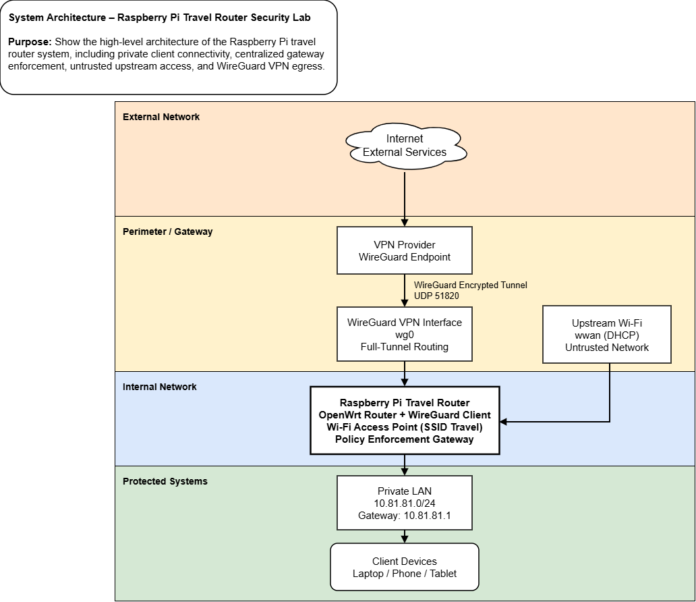
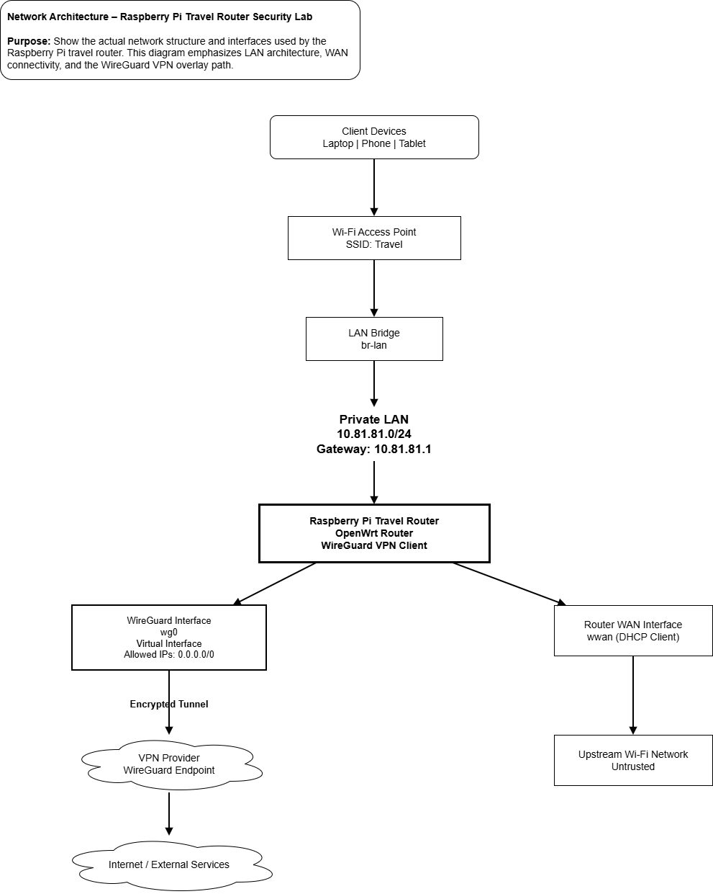
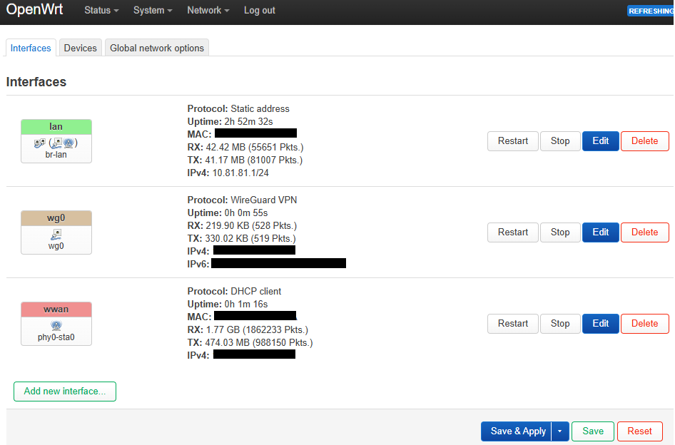
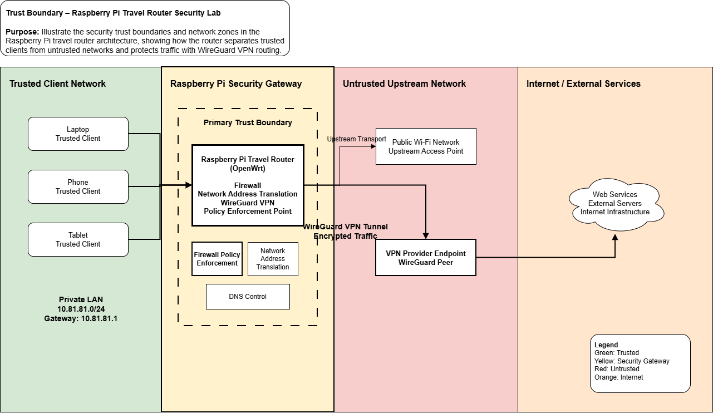

# 📄 Raspberry Pi Travel Router Security Lab


A portable network security lab implementing **VPN-first routing, DNS enforcement, and firewall segmentation** using **OpenWrt on a Raspberry Pi**.

📄 **Full Project Documentation**  
[Travel Router Security Architecture Lab](./docs/travel-router-security-architecture-lab.pdf)

## Architecture Summary

The system is a **Raspberry Pi travel router running OpenWrt** that connects to untrusted upstream Wi-Fi networks and routes all client traffic through a **WireGuard VPN tunnel**.

The router acts as a **security enforcement gateway**, applying firewall segmentation, DNS control, and VPN-first routing to protect connected devices.

**High-level flow**

Client Devices → Travel Router → WireGuard VPN → Internet

---

# Security Concepts & Controls

The router architecture incorporates several network security controls implemented through OpenWrt configuration and firewall policy.

| Security Concept | Implementation |
|---|---|
| **VPN-first routing** | Firewall forwarding restricts LAN traffic to the WireGuard interface |
| **DNS enforcement** | Firewall redirects force all DNS queries to the router resolver |
| **DNSSEC validation** | DNSMasq configured to validate DNS responses |
| **IPv6 leak prevention** | IPv6 DHCP, RA, and SLAAC disabled |
| **Firewall segmentation** | Separate LAN, WAN, and VPN zones |
| **Secure management surface** | SSH and LuCI restricted to LAN |
| **Rogue DHCP protection** | Firewall rules block unauthorized DHCP responses |
| **Network trust boundary** | Router enforces centralized security controls for all clients |

Together these controls ensure that **all client traffic follows the intended encrypted routing path**.

---

# Table of Contents

- [Architecture Summary](#architecture-summary)
- [Security Concepts & Controls](#security-concepts--controls)
- [Project Overview](#project-overview)
- [System Architecture](#system-architecture)
- [Network Architecture](#network-architecture)
- [Trust Boundary](#trust-boundary)
- [Core Components](#core-components)
- [Testing Methodology](#testing-methodology)
- [Limitations](#limitations)
- [Future Improvements](#future-improvements)
- [Skills Demonstrated](#skills-demonstrated)
- [Repository Structure](#repository-structure)
- [Author](#author)

---

# Project Overview

Public networks (hotels, airports, cafés, and temporary housing) are environments where users have little control over the underlying infrastructure.

Even when a device-level VPN is enabled, traffic can still behave unpredictably due to:

- DNS queries leaving the VPN tunnel
- IPv6 alternate routing paths
- fallback routes when a VPN disconnects
- exposure to upstream network scanning

Instead of relying on each individual device to configure its own security settings, this project enforces security controls **at the network gateway itself**.

A **Raspberry Pi running OpenWrt** acts as a travel router that:

- routes all traffic through a **WireGuard VPN**
- enforces **centralized DNS resolution**
- prevents **LAN → WAN traffic bypass**
- restricts **administrative access**
- reduces **IPv6 routing leakage**

By centralizing routing and DNS policies at the gateway, all connected devices automatically follow the same security controls without requiring configuration changes on each endpoint.

This architecture mirrors how many organizations implement **network security controls at trusted boundaries**, where routing policy, DNS enforcement, and segmentation are centralized within network infrastructure.

---

# System Architecture

The router acts as an intermediary gateway between client devices and upstream networks.

**Client traffic flow**

```text
Client Device
     │
     ▼
Travel Router (OpenWrt)
     │
     ▼
WireGuard VPN Tunnel
     │
     ▼
Internet
```

### System Architecture Diagram



The architecture enforces centralized control over:

- routing behavior
- DNS resolution
- firewall policy
- administrative access

---

# Network Architecture

The network architecture illustrates how the router connects the private LAN, upstream network, and encrypted VPN tunnel.



The router maintains three primary network interfaces:

- **LAN bridge (br-lan)** — private network for connected client devices  
- **WAN interface (wwan)** — upstream connectivity to external Wi-Fi networks  
- **WireGuard interface (wg0)** — encrypted VPN tunnel for outbound traffic  

Firewall zones enforce segmentation between these networks and ensure that client traffic follows the intended routing path.

### OpenWrt Interface Configuration

The following OpenWrt interface view shows the active LAN, WAN, and WireGuard interfaces used in the architecture.



---

# Trust Boundary

The trust boundary diagram highlights how the router separates **trusted client devices** from **untrusted upstream networks**.



The Raspberry Pi router functions as a **policy enforcement gateway**, controlling how traffic flows between zones.

Security policies applied at this boundary include:

- firewall rule enforcement
- VPN-first routing
- DNS control
- administrative access restrictions

---

# Core Components

| Component | Purpose |
|---|---|
| **Raspberry Pi 4** | Hardware platform hosting the router |
| **OpenWrt** | Router operating system and network control plane |
| **WireGuard** | Encrypted VPN tunnel for outbound traffic |
| **Mullvad VPN** | Upstream VPN provider |
| **dnsmasq** | DNS resolver and DHCP service |
| **fw4 / nftables** | Zone-based firewall |
| **Dropbear** | SSH management access |
| **LuCI** | Web configuration interface |

---

# Testing Methodology

After configuration, several tests validated that routing and DNS controls behaved as expected.

| Test | Validation |
|---|---|
| DNS server assignment | `dig google.com @10.81.81.1` |
| VPN routing | `ip route` and firewall rules |
| DNS leak testing | Online DNS leak tools |
| External IP verification | `curl ifconfig.me` |
| VPN tunnel health | `wg show` |
| Fail-closed testing | Disable VPN interface |

Results confirmed that:

- all DNS queries are routed through the router
- outbound traffic exits through the VPN tunnel
- LAN → WAN bypass is blocked
- administrative access is LAN-only

Configuration artifacts supporting these controls can be found in [`configs`](./configs).

---

# Limitations

This implementation focuses primarily on **routing and DNS control**, not full network monitoring.

Known limitations include:

- single-device gateway architecture
- limited traffic visibility
- dependency on VPN availability
- no deep packet inspection or IDS
- hardware performance limits of Raspberry Pi

---

# Future Improvements

Planned future enhancements include:

- Suricata IDS integration
- Zeek network telemetry
- centralized logging
- VPN health monitoring
- VLAN segmentation for device classes

These additions would further expand the system into a **portable network security experimentation platform**.

---

# Skills Demonstrated

This project demonstrates practical experience in:

- Linux networking
- VPN configuration (WireGuard)
- firewall policy design
- DNS enforcement
- network segmentation
- troubleshooting complex routing behavior
- translating security goals into infrastructure controls

---

# Repository Structure

Project artifacts are organized into the following directories:

- [`docs`](./docs) — Project documentation, screenshots, and architecture report  
- [`diagrams`](./diagrams) — Architecture, data flow, trust boundary, and threat model diagrams  
- [`configs`](./configs) — Sanitized OpenWrt configuration snapshots and automation scripts  

---

## Repository Layout

- [LICENSE](LICENSE) — repository license  
- [README.md](README.md) — project overview and navigation  

### configs/

Configuration snapshots and automation scripts.

- [README.md](configs/README.md) — explanation of configuration artifacts and scripts
- [dhcp_dns_config_sanitized.txt](configs/dhcp_dns_config_sanitized.txt)
- [firewall_policy_sanitized.txt](configs/firewall_policy_sanitized.txt)
- [hotplug_time_fix.sh](configs/hotplug_time_fix.sh)
- [hotplug_wg_after_ntp.sh](configs/hotplug_wg_after_ntp.sh)
- [network_config_sanitized.txt](configs/network_config_sanitized.txt)
- [vpn_monitor.sh](configs/vpn_monitor.sh)
- [wifi_recovery_at_boot.sh](configs/wifi_recovery_at_boot.sh)
- [wireless_config_sanitized.txt](configs/wireless_config_sanitized.txt)

### diagrams/

Architecture and security diagrams used throughout the documentation.

- [README.md](diagrams/README.md) — explanation of architecture and security diagrams
- [data_flow.png](diagrams/data_flow.png)
- [network_architecture.png](diagrams/network_architecture.png)
- [security_controls.png](diagrams/security_controls.png)
- [system_architecture.png](diagrams/system_architecture.png)
- [threat_model.png](diagrams/threat_model.png)
- [trust_boundary.png](diagrams/trust_boundary.png)

### docs/

Compiled project documentation and supporting assets.

- [travel-router-security-architecture-lab.pdf](docs/travel-router-security-architecture-lab.pdf) — full architecture and security documentation

#### docs/screenshots/

Interface screenshots and configuration evidence used in the README.

- [openwrt_interfaces.png](docs/screenshots/openwrt_interfaces.png) — OpenWrt interface overview showing LAN, WAN, and WireGuard interfaces

---

# Author

Jennifer Byrnes  
Cybersecurity Portfolio Project  
March 2026
